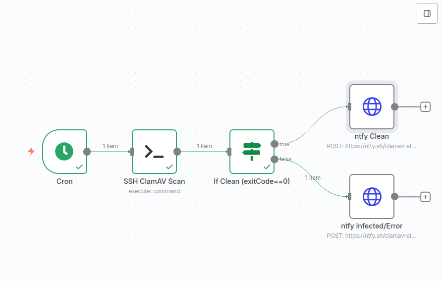

<p align="center">
  
</p>

<h1 align="center">📅 Daily Dashboard</h1>

<p align="center"><i>
Flask + Docker app showing real-time weather, quote of the day, and per-city timezones.
</i></p>

<p align="center">
  <a href="https://ko-fi.com/s/507501790f">
    
  </a>
</p>

<p align="center">
  <a href="LICENSE"></a>
  
  
</p>

---

[](https://github.com/gusinfosec/n8n-clamav-sentinel/stargazers)


A tiny Flask app in a Docker container that shows:
- **Current weather** + next 24h and daily highs/lows (OpenWeather)
- **Quote of the day**
- **Local time** (per-city, if you apply the timezone patch)

# Daily Dashboard

A simple Dockerized Flask app for weather + quotes.



Runs anywhere Docker/Podman runs. Includes a one-shot `install.sh` that:
- Builds the image
- Creates `/etc/daily-dashboard.env`
- Sets up a **systemd** service (`daily-dashboard`)
- Adds a desktop launcher
- Starts the service

---

## Features

- Weather from OpenWeather (current + forecast)
- Local rotating quotes (works even if rate-limited)
- Simple UI, zero JS frameworks
- **Config via env only** (no rebuild needed when you change city/units)
- Works with Docker or Podman

---

## Quick Start (one-liner)

```bash
# one-off local run (replace key and city)
docker build -t daily-dashboard:latest .
docker run --rm -p 5000:5000 \
  -e OWM_API_KEY=YOUR_KEY \
  -e CITY="Boca Raton" -e COUNTRY="US" -e UNITS="imperial" \
  daily-dashboard:latest
# open http://localhost:5000

```

### Roadmap
See [ROADMAP.md](ROADMAP.md) for planned features and future ideas.

---

## 📝 License

MIT. See `LICENSE` for details.
